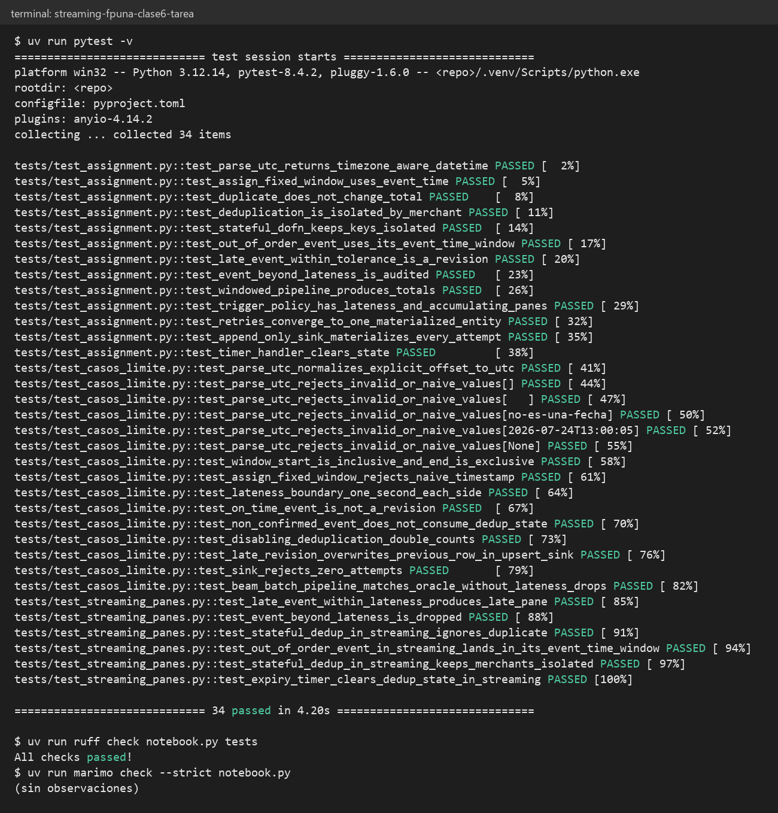
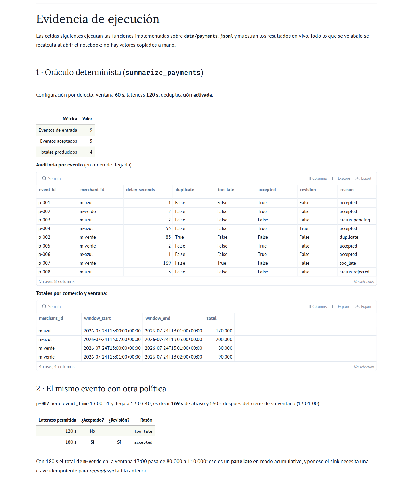
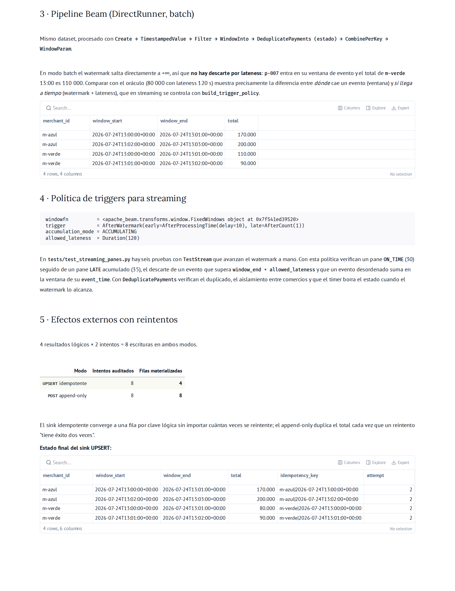

# Tarea 3 - Estado, duplicados e idempotencia con Apache Beam

Mi solución de la Tarea 3 de *Streaming de datos y sus aplicaciones* (MIAAD,
FP-UNA). Este repositorio es un fork del esqueleto
[`rparrapy/streaming-fpuna-clase6-tarea`](https://github.com/rparrapy/streaming-fpuna-clase6-tarea):
las funciones del notebook están implementadas y el resto del proyecto
(`pyproject.toml`, `uv.lock`, `Dockerfile`, `docker-compose.yml`, los datos y
las pruebas provistas) quedó igual.

Las 34 pruebas pasan: las 13 que venían con la tarea, 6 que agregué con
`TestStream` y 15 de casos límite (bordes de ventana y de lateness, entradas
inválidas, equivalencia oráculo-Beam). La salida de pytest está en
[`docs/evidencia_pytest.txt`](docs/evidencia_pytest.txt), la de los chequeos
de estilo en [`docs/evidencia_checks.txt`](docs/evidencia_checks.txt) y las
capturas de pantalla en [`docs/capturas/`](docs/capturas/) (ver
[Evidencia de ejecución](#evidencia-de-ejecución)).

## Objetivo

Calcular el total confirmado por comercio y por minuto a partir de
`data/payments.jsonl`, aunque los pagos lleguen desordenados, duplicados o
tarde, y aunque la escritura del resultado tenga que reintentarse.

## Cómo ejecutar

### Con `uv`

```bash
git clone https://github.com/abarchello/streaming-fpuna-clase6-tarea.git
cd streaming-fpuna-clase6-tarea
uv sync --frozen                   # crea .venv con las versiones de uv.lock
uv run pytest -v                   # suite completa (34 pruebas)
uv run marimo run notebook.py      # notebook en modo app, con la evidencia
uv run marimo edit notebook.py     # o en modo editor
uv run ruff check notebook.py tests
uv run marimo check --strict notebook.py
```

El `Makefile` tiene los mismos atajos: `make install`, `make test`,
`make check`, `make run`.

### Con Docker

```bash
docker compose up --build notebook     # editor en http://localhost:2718
docker compose exec notebook uv run pytest
```

`data/payments.jsonl` está tal cual vino.

## Qué implementé

| Función o clase | Para qué sirve | Decisión principal |
|---|---|---|
| `parse_utc` | Tiempo de evento | Acepta `Z` o un offset explícito y siempre devuelve UTC. Si el timestamp no tiene zona horaria o es inválido, lanza `ValueError`. |
| `assign_fixed_window` | Ventanas fijas | Hace la misma cuenta que `FixedWindows` de Beam: ventanas `[inicio, fin)` alineadas al epoch. |
| `summarize_payments` | Oráculo en Python puro | Recorre los eventos en orden de llegada y usa `arrival_time` como si fuera el watermark (lo explico abajo). |
| `build_windowed_totals_pipeline` | Pipeline Beam | `Create`, `TimestampedValue`, `Filter`, `WindowInto`, clave por comercio, `DeduplicatePayments`, `CombinePerKey(sum)` y los límites de ventana con `WindowParam`. |
| `DeduplicatePayments` | Estado por clave con timer | Guarda los `event_id` vistos por comercio y ventana en un `SetState`. Un timer de watermark en `window_end + allowed_lateness` borra ese estado. |
| `build_trigger_policy` | Contrato de salida | `AfterWatermark(early=AfterProcessingTime(10), late=AfterCount(1))`, modo `ACCUMULATING`, `allowed_lateness` de 120 s. |
| `make_idempotency_key` | Identidad del resultado | `merchant_id|window_start`. |
| `simulate_sink_retries` | Escrituras con reintento | `UPSERT` sobre un `dict` (idempotente) frente a `POST` sobre una `list` (sólo agrega). |

## Contrato temporal

El oráculo en Python no tiene un watermark de verdad, así que usé la
aproximación más parecida a Beam: cuando proceso un evento, tomo su
`arrival_time` como el watermark de ese momento.

| Condición | Qué pasa | En Beam sería |
|---|---|---|
| `status` distinto de `CONFIRMED` | Se descarta con `reason=status_<x>` | `Filter` |
| `arrival_time > window_end + allowed_lateness` | `too_late=True`, no suma | La ventana ya se cerró y el dato se pierde |
| `arrival_time > window_end`, pero se acepta | `revision=True` | Un pane late en modo acumulativo |
| `(merchant_id, event_id)` repetido | `duplicate=True`, no suma | `DeduplicatePayments` |
| cualquier otro caso | `accepted=True`, suma al total | Pane on-time |

Evalúo primero el estado del pago, después la tolerancia y al final el
duplicado. Un evento que llega fuera de tolerancia no llega a tocar el estado
de deduplicación. En Beam pasa lo mismo: un dato que se descarta por lateness
nunca llega al `DoFn`.

Con la configuración por defecto (ventanas de 60 s, 120 s de tolerancia y
deduplicación) entran 9 eventos, se aceptan 5 y salen 4 totales:

| event_id | comercio | atraso | decisión |
|---|---|---:|---|
| p-001 | m-azul | 1 s | aceptado |
| p-002 | m-verde | 2 s | aceptado |
| p-003 | m-azul | 2 s | `status_pending` |
| p-004 | m-azul | 53 s | aceptado como revisión (llega 35 s después del cierre de las 13:00) |
| p-002 (repetido) | m-verde | 83 s | duplicado |
| p-005 | m-verde | 2 s | aceptado |
| p-006 | m-azul | 1 s | aceptado |
| p-007 | m-verde | 169 s | `too_late` (llega 160 s después del cierre y la tolerancia es de 120 s) |
| p-008 | m-azul | 3 s | `status_rejected` |

Si subo `allowed_lateness_seconds` a 180, `p-007` pasa a `accepted=True,
revision=True` y el total de `m-verde` a las 13:00 sube de 80 000 a 110 000.
Ese ejemplo muestra por qué hace falta la clave idempotente: la revisión
tiene que pisar la fila anterior, no sumarse como una fila nueva.

## Pruebas

La consigna pide como mínimo siete casos. Cada uno queda cubierto al menos
una vez con la lógica en Python y, donde tiene sentido, también en modo
streaming con `TestStream`, donde el watermark lo muevo yo:

| Caso mínimo | Prueba provista (`test_assignment.py`) | Prueba propia con `TestStream` (`test_streaming_panes.py`) |
|---|---|---|
| Duplicado | `test_duplicate_does_not_change_total` | `test_stateful_dedup_in_streaming_ignores_duplicate` |
| Claves aisladas | `test_deduplication_is_isolated_by_merchant`, `test_stateful_dofn_keeps_keys_isolated` | `test_stateful_dedup_in_streaming_keeps_merchants_isolated` |
| Evento fuera de orden | `test_out_of_order_event_uses_its_event_time_window` | `test_out_of_order_event_in_streaming_lands_in_its_event_time_window` |
| Late aceptado | `test_late_event_within_tolerance_is_a_revision` | `test_late_event_within_lateness_produces_late_pane` |
| Demasiado tardío | `test_event_beyond_lateness_is_audited` | `test_event_beyond_lateness_is_dropped` |
| Timer de limpieza | `test_timer_handler_clears_state` | `test_expiry_timer_clears_dedup_state_in_streaming` |
| Escritura repetida | `test_retries_converge_to_one_materialized_entity`, `test_append_only_sink_materializes_every_attempt` | (no aplica: el sink es una simulación en Python) |

Además, `tests/test_casos_limite.py` cubre los bordes que la consigna no
pide explícitamente:

| Caso límite | Prueba |
|---|---|
| Offset explícito (`-03:00`) normalizado a UTC | `test_parse_utc_normalizes_explicit_offset_to_utc` |
| Vacío, basura, sin zona horaria o `None` lanzan `ValueError` | `test_parse_utc_rejects_invalid_or_naive_values` (5 casos) |
| Ventana `[inicio, fin)`: 13:01:00 abre la ventana siguiente | `test_window_start_is_inclusive_and_end_is_exclusive` |
| Un segundo antes y un segundo después de `window_end + lateness` | `test_lateness_boundary_one_second_each_side` |
| Un evento a tiempo no es revisión | `test_on_time_event_is_not_a_revision` |
| Un `PENDING` no ocupa estado: su versión `CONFIRMED` posterior cuenta | `test_non_confirmed_event_does_not_consume_dedup_state` |
| Sin deduplicación el duplicado se cuenta dos veces | `test_disabling_deduplication_double_counts` |
| Un pane late (30 → 35) pisa la fila en UPSERT; en append se suman (65) | `test_late_revision_overwrites_previous_row_in_upsert_sink` |
| `attempts=0` es un error | `test_sink_rejects_zero_attempts` |
| El pipeline Beam en batch coincide fila por fila con el oráculo sin descartes por lateness | `test_beam_batch_pipeline_matches_oracle_without_lateness_drops` |

La última prueba es la que ata las dos implementaciones: sobre el dataset
real, el oráculo en Python con tolerancia enorme y el pipeline Beam (donde en
batch el watermark salta a +∞) producen exactamente los mismos totales.

La prueba del timer en streaming merece una aclaración. Para que el borrado
se vea desde afuera, armo una ventana que acepta datos tardíos durante 300 s
y un `DeduplicatePayments` que expira su estado a los 0 s. Cuando el
watermark pasa el fin de la ventana, el timer borra `seen_ids` y el mismo
`event_id` vuelve a pasar. Si en esa prueba le doy al DoFn 300 s de
tolerancia, el duplicado se filtra y la prueba falla, que es justamente lo que
quiero mostrar: el timer tiene que vencer en `window_end + allowed_lateness`,
nunca antes.

## Ventanas, triggers y panes

`build_trigger_policy` arma la política para streaming. Mientras la ventana
está abierta, cada 10 s de tiempo de procesamiento sale un pane early con una
estimación provisoria; es rápido, pero incompleto. Cuando el watermark cruza
el final de la ventana sale el pane on-time, que es el resultado "oficial".
Después, cada dato tardío que llegue dentro de los 120 s de tolerancia genera
un pane late con la corrección.

El modo es `ACCUMULATING`, o sea que cada pane trae el total completo y no la
diferencia. Eso permite escribir con `UPSERT`. Con `DISCARDING` el consumidor
tendría que ir sumando panes, y la clave idempotente ya no alcanzaría para
evitar errores.

En `tests/test_streaming_panes.py` corro esta política con `TestStream` y
avanzo el watermark a mano. Una de las pruebas verifica que primero sale
`("m-a", 30, ON_TIME)` y después `("m-a", 35, LATE)`, y otra que un evento que
llega pasado `window_end + allowed_lateness` se descarta.

> Un detalle técnico: `Duration` de Beam no tiene el atributo `.seconds`, y
> una de las pruebas de la tarea lo usa. Para que pase, le paso a
> `FixedWindows` y a `allowed_lateness` una subclase `Seconds(Duration)` que
> sí lo tiene. Como `Duration.of()` devuelve la misma instancia, Beam la usa
> sin problemas.

## Estado y expiración

`DeduplicatePayments` guarda en un `SetState` los `event_id` que ya vio. En
Beam el estado se separa por clave y por ventana. Por eso el mismo `event_id`
en `m-a` y en `m-b` produce dos salidas
(`test_stateful_dofn_keeps_keys_isolated`), mientras que el mismo `event_id`
dos veces en `m-a` produce una sola
(`test_stateful_dedup_in_streaming_ignores_duplicate`).

Sin expiración, ese estado crecería para siempre. En un stream que no termina
siempre aparecen `event_id` nuevos, y si nadie los borra, el conjunto de cada
clave va acumulando todos los ids que pasaron alguna vez, así que la memoria
del worker crece con todo el tráfico histórico. Por eso el timer se arma en
`window_end + allowed_lateness`. A partir de ese momento la ventana ya no
acepta datos, y guardar sus ids no evita ningún duplicado que importe. El
estado queda limitado justo al período en que un duplicado todavía podría
cambiar un total.

## Idempotencia y reintentos

En la práctica las escrituras fallan: hay timeouts, el runner reintenta, y los
panes late vuelven a escribir la misma ventana. `simulate_sink_retries`
compara las dos formas de escribir:

| Modo | Estructura | 4 resultados con 2 intentos cada uno |
|---|---|---:|
| `UPSERT` idempotente | `dict[idempotency_key] = row` | 8 intentos registrados, 4 filas finales |
| `POST` que sólo agrega | `list.append(row)` | 8 intentos registrados, 8 filas finales |

La clave `merchant_id|window_start` identifica el resultado (un comercio en
una ventana), no el intento de escritura. Un pane late y un reintento por
timeout terminan en la misma fila, y el total final es correcto aunque el
pipeline sólo garantice *at-least-once*.

## Decisiones y alternativas

| Lo que hice | Alternativa | Por qué |
|---|---|---|
| Usar `arrival_time` como watermark en el oráculo | Un watermark heurístico (máximo `event_time` visto menos una holgura) | Es reproducible y fácil de explicar. El watermark real lo pongo con `TestStream` en las pruebas. |
| Medir la tolerancia desde `window_end` | Medirla desde `event_time` (atraso mayor que la tolerancia) | Así lo hace Beam. En este dataset las dos dan el mismo resultado, pero en general no. |
| Evaluar estado, después tolerancia, después duplicado | Chequear el duplicado antes que la tolerancia | Un dato descartado por llegar tarde no tiene por qué ocupar estado. |
| Panes early cada 10 s | Sin panes early | Muestran el compromiso entre latencia y completitud, a cambio de más escrituras. |
| Timer en `window_end + lateness` | Timer en `window_end` | Si borro antes, un duplicado que llega tarde se podría contar. |
| `ACCUMULATING` con `UPSERT` | `DISCARDING` y que el consumidor sume | El destino no necesita saber nada de panes. |
| Type hint `Tuple[str, Any]` antes de `DeduplicatePayments` | Dejar que Beam infiera el coder de la clave | El estado por clave necesita un coder determinista. Sin el hint, Beam avisa que `FastPrimitivesCoder` podría no serlo. |

## Evidencia de ejecución

Suite completa (34 pruebas) y chequeos de estilo:



Notebook ejecutado con `uv run marimo run notebook.py`: el oráculo en Python
y el mismo evento con otra política de lateness.



El pipeline Beam, la política de triggers y el sink con reintentos.



## Estructura

```
notebook.py                   # implementación y evidencia (Marimo)
data/payments.jsonl           # dataset de la tarea, sin cambios
tests/test_assignment.py      # pruebas provistas
tests/test_streaming_panes.py # 6 pruebas propias con TestStream
tests/test_casos_limite.py    # 15 pruebas propias de casos límite
docs/evidencia_pytest.txt     # salida de `uv run pytest -v`
docs/evidencia_checks.txt     # salida de ruff y marimo check
docs/capturas/                # capturas de pantalla de la ejecución
```
